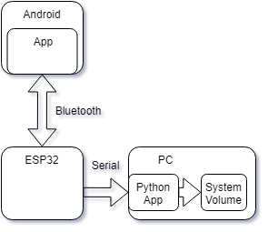

# Android -> ESP32 -> PC Volume Adjuster
## Description
The goal of this repo is to allow adjustment of a Window's machines volume from
an Android phone. The simple way would be directly over the network, but lets
throw an ESP32 in there for fun.

The flow is an Android application -> SPP Bluetooth -> ESP32 -> Serial -> Python

     

## Running
* Install Android Studio SDK and open the project in `./android`
    * Set up developer options to deploy the debug version of the application
    * Find the newly installed PC_Volume application
    * See [it's readme](./android/README.md) for some notes
* Build/flash the ESP32 firmware - see the [ESP Readme](./esp32/README.md)
* Run the top level python module `./python_interface/audio_adjuster.py`
    * See [it's readme](./python_interface/README.md) for some installation help
    * Can also use the AutoHotkey script `./python_interface/LaunchESPCmdHandler.ahk`
* Use the PC_Volume application to enable Bluetooth and connect to `SPACES_ESP`
    * Check the Python program for prints indicating a connection
    * Use the PC_Volume buttons to turn the PC's volume up / down / to mute
